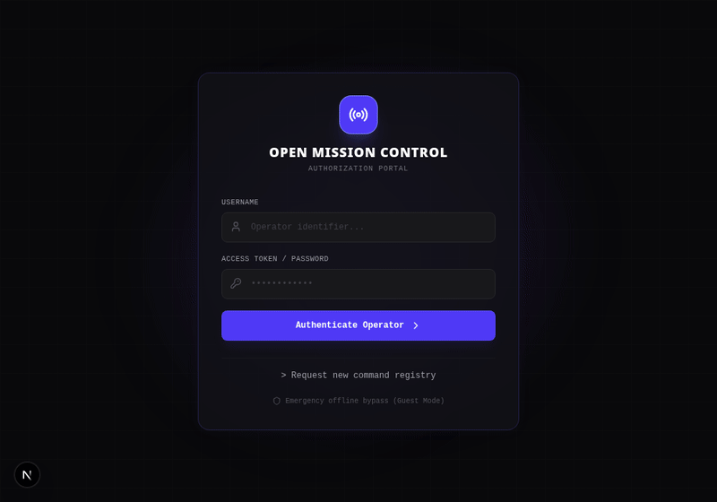
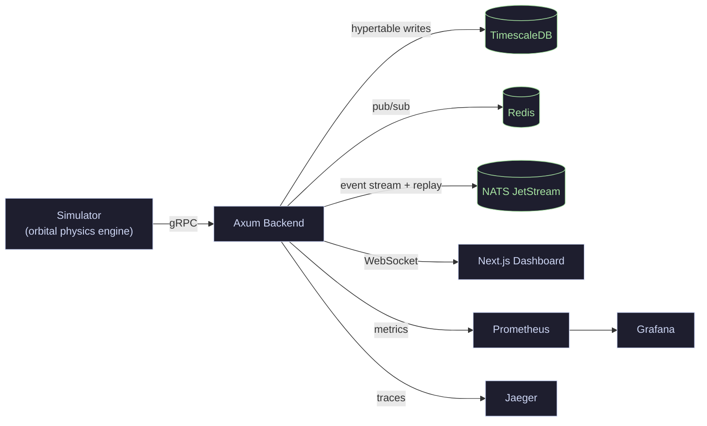

# Open Mission Control

A real-time satellite ground-control platform: a Rust/Axum backend that ingests telemetry over gRPC, stores it in a TimescaleDB hypertable, fans it out over Redis pub/sub and NATS JetStream, and serves it to a Next.js mission-ops dashboard over WebSockets.

📖 [Browse the docs site](https://s7g4.github.io/omc/) · 

---

## Architecture



- **`backend/`** — Axum HTTP/WebSocket server plus a `tonic` gRPC service for telemetry ingestion. Auth (Argon2id + JWT + refresh-token rotation), RBAC, audit logging, mission CRUD, telemetry, health probes, and rate limiting/circuit-breaking each live in their own module.
- **`simulator/`** — a standalone Rust binary modeling satellite orbital mechanics (vis-viva velocity, radiative thermal balance, cosine solar law), a comms channel (simulated packet loss + GPS drift), and streaming synthetic telemetry to the backend over gRPC.
- **`frontend/`** — Next.js dashboard (`AuthScreen`, `MissionsOverview`, `TelemetryGrid`, `LiveCharts`, `EventsLog`, `SimControl`) that authenticates against the backend and renders live telemetry over WebSockets.
- **`proto/telemetry.proto`** — the gRPC schema shared between the simulator and the backend.
- **`grafana/` / `prometheus/`** — provisioned dashboards and scrape config for the backend's Prometheus metrics endpoint.
- **`docs/`** — [DEMO.md](docs/DEMO.md) (walkthrough), [CASE_STUDY.md](docs/CASE_STUDY.md) (engineering decisions), [adr/](docs/adr/) (short per-decision records).

---

## Data layer

Telemetry is stored in a TimescaleDB hypertable (`backend/migrations/0003_timescaledb.sql`) with a compression policy on cold chunks (`0004_compression.sql`, segmented by `satellite_id`) — new telemetry stays fast to write and query, older data compresses automatically instead of growing the table unbounded.

## Auth, RBAC & audit

Two roles (`operator`, `admin`) gate destructive actions (mission delete, satellite unassignment) behind an `AdminClaims` extractor. Access tokens are short-lived JWTs; refresh tokens are opaque, hashed, server-side-revocable, and rotate on every use — reusing an already-rotated refresh token revokes the entire session chain. Every `/api/v1/*` request is written to an immutable `audit_logs` table (actor, method, path, status, source IP), browsable at `GET /api/v1/audit-logs` (admin-only).

## Observability & resilience

- **Metrics**: Prometheus at `/metrics`, provisioned Grafana dashboards (request rate/latency, telemetry ingest rate, active WebSocket connections).
- **Tracing**: OpenTelemetry spans exported to a local Jaeger instance, with a `trace_id` threaded through gRPC ingestion and into the NATS-published payload for cross-component correlation.
- **Health**: `/health` (liveness), `/live`, `/ready` (checks Postgres/Redis/NATS connectivity, 503 on failure).
- **Resilience**: per-IP rate limiting on `/api/v1/*`, a circuit breaker wrapping the Redis and NATS publish paths.
- **API docs**: Swagger UI at `/swagger-ui`, OpenAPI spec at `/api-docs/openapi.json`.

---

## Running it locally

```bash
docker compose up -d          # Postgres/TimescaleDB, Redis, NATS, Prometheus, Grafana, Jaeger
cd backend && cargo run       # Axum + gRPC backend
cd simulator && cargo run     # synthetic satellite telemetry over gRPC
cd frontend && npm install && npm run dev
```

Or the whole thing in one command (see [docs/DEMO.md](docs/DEMO.md) for the full walkthrough):

```bash
docker compose -f docker-compose.prod.yml up --build
```

| Service | Port |
|---|---|
| Backend (HTTP/WS) | `8081` |
| Backend (gRPC) | `50051` |
| Frontend | `3000` |
| Postgres (TimescaleDB) | `5433` |
| Redis | `6380` |
| NATS | `4222` (client), `8222` (monitoring) |
| Prometheus | `9090` |
| Grafana | `3001` |
| Jaeger UI | `16686` |

---

## Testing

```bash
cargo fmt --check && cargo clippy --workspace --all-targets -- -D warnings && cargo test --workspace
docker compose up -d postgres redis nats && cargo test --test e2e_pipeline -p backend  # full pipeline
k6 run tests/load/k6_soak.js                                                           # load test
```

CI (`.github/workflows/ci.yml`) runs Rust checks/clippy/tests, a full gRPC→DB→NATS→WebSocket integration test against real service containers, and a Next.js lint/build — on every push and PR.

---

## Status

Feature-complete for its scope as a documented, demoable platform: gRPC ingestion, TimescaleDB storage, dual pub/sub (Redis + NATS JetStream), auth with RBAC and refresh-token rotation, audit logging, OpenTelemetry tracing, rate limiting/circuit breaking, a real end-to-end integration test, and Dockerfiles for a single-command containerized boot are all implemented and wired end-to-end against the simulator. Run it locally per above. See [DEVLOG.md](DEVLOG.md) for the build history and problems encountered along the way, or [docs/CASE_STUDY.md](docs/CASE_STUDY.md) for the engineering decisions behind it.
